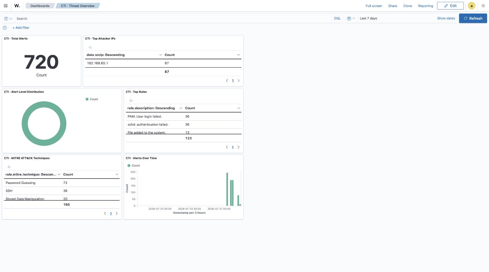
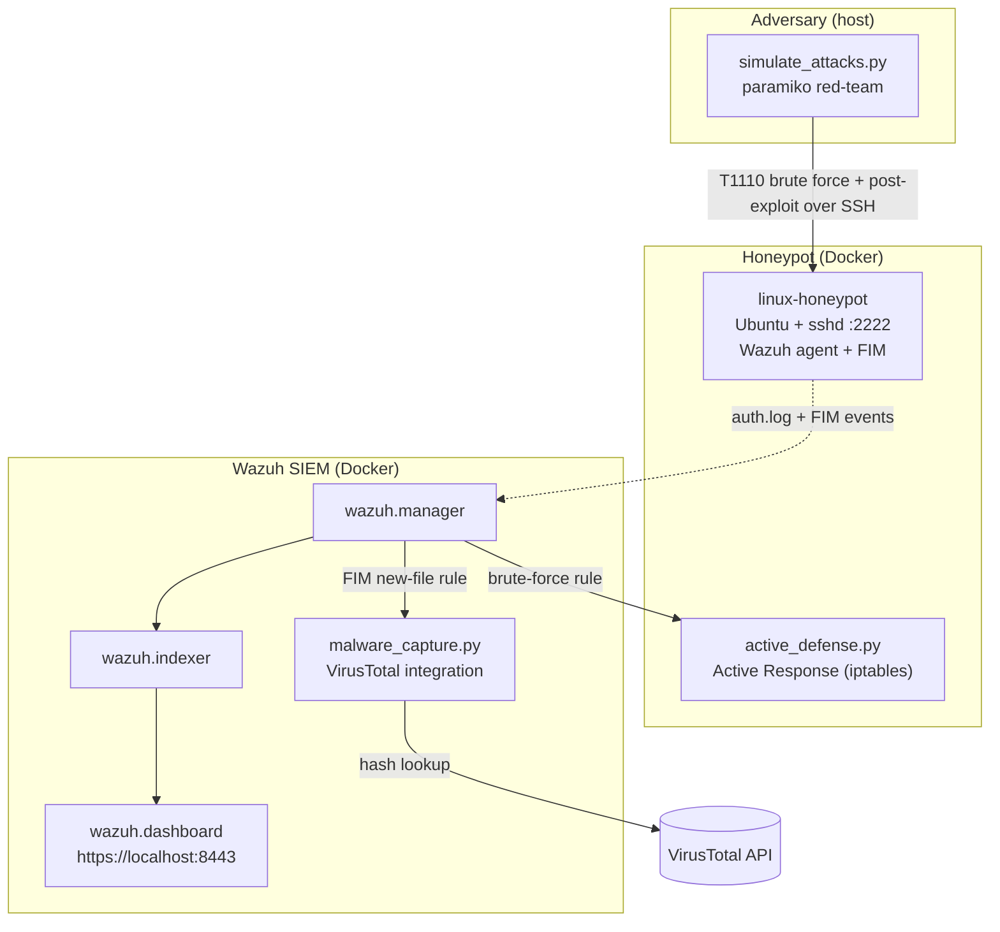

# Threat Intelligence Lab & Active Defense SIEM

<div align="center">
  
  
  
  
  
  
</div>
<br>

> **Detect, respond to, and hunt SSH attacks end-to-end — a Dockerised Wazuh SIEM with a live honeypot and Python SOAR automation.**

A self-contained cybersecurity lab that stands up a **Wazuh SIEM**, an **SSH
honeypot that reports to it as a real agent**, and a **Python red-team script**
that walks a full Cyber Kill Chain against the honeypot. Real attack traffic
produces real detections, which trigger two Python **SOAR** automations:
an Active-Response IP ban and a VirusTotal malware lookup.

Everything runs in Docker on a single host. No cloud account, no separate VMs.

📚 **[API reference & developer portal →](https://jessn-dev.github.io/CTI-Lab/)** — a full API-reference docs site (auth, endpoints, cURL/Python/JS snippets, error maps), deployed via **GitHub Pages** from `/docs`.

## Demo


*One `./bin/attack.sh` run, from the real lab: brute-force → foothold → EICAR drop, and Wazuh's automatic response — brute-force detection (rule 5763), an iptables ban, and a VirusTotal verdict.*

The custom **CTI · Threat Overview** dashboard after a few runs — top attacker IP, alert levels, MITRE ATT&CK techniques, top rules, and alerts over time:



---

## Table of Contents
0. [Demo](#demo) · [API reference portal ↗](https://jessn-dev.github.io/CTI-Lab/)
1. [What it does](#what)
2. [Architecture](#architecture)
3. [The attack → detect → respond flow](#flow)
4. [MITRE ATT&CK coverage](#mitre)
5. [Install & run](#install)
6. [Verifying it worked](#verify)
6b. [AI Threat Analyst (Phase A)](#analyst)
6c. [Attack it yourself (manual)](#attack)
7. [Project layout](#layout)
7b. [Scripts reference](#scripts)
7c. [Add-on: beelzebub LLM honeypot](#beelzebub)
7d. [Add-on: shelLM LLM honeypot](#shellm)
7e. [Adaptive Engagement (Phase C)](#engagement)
8. [Scope, honesty & limitations](#limits)
9. [Troubleshooting](#troubleshooting)

---

<a name="what"></a>
## 1. What it does

- **Bait.** An Ubuntu container runs a real `sshd` with a deliberately weak
  `root:toor` login exposed on port `2222`.
- **Monitor.** The honeypot has a **Wazuh agent baked in**. It enrolls with the
  Wazuh manager on boot and ships `auth.log` and File Integrity Monitoring (FIM)
  events. This is the piece that makes the SIEM story *true*: the manager
  actually receives telemetry.
- **Attack.** `src/redteam/simulate_attacks.py` uses **paramiko** to perform a real
  SSH brute-force, then opens a session and runs post-exploitation (recon,
  credential dumping, a backdoor account, an EICAR malware drop, log wiping).
- **Detect.** Wazuh's built-in rules flag the brute-force and the dropped file.
- **Respond (SOAR):**
  - `src/soar/active_defense.py` runs on the honeypot as a **Wazuh Active
    Response** and `iptables`-bans the attacker's IP (auto-unban on timeout).
  - `src/soar/malware_capture.py` runs on the manager as a **Wazuh integration**,
    pulls the FIM SHA-256 out of the alert, and queries the **VirusTotal API**.

<a name="architecture"></a>
## 2. Architecture

Single Docker Compose stack, one network. Based on the official Wazuh 4.8
single-node deployment (TLS-secured indexer/manager/dashboard) plus a custom
honeypot service.



**Diamond Model:** *Adversary* = the paramiko script · *Capability* = SSH
credential attack + EICAR payload · *Infrastructure* = Docker network, port 2222
· *Victim* = the honeypot container.

<a name="flow"></a>
## 3. The attack → detect → respond flow

| # | Red-team action (real) | Blue-team reaction (real) |
|---|------------------------|---------------------------|
| 1 | Port probe of `:2222` | — |
| 2 | SSH password brute-force (paramiko) | Wazuh rules **5710 / 5712** fire → **Active Response bans the source IP** |
| 3 | `whoami`, `uname -a`, `cat /etc/passwd`, `cat /etc/shadow` over SSH | Command/auth telemetry in the SIEM |
| 4 | Create backdoor user `sysadmin_bckp` | FIM change on `/etc`, new-account event |
| 5 | `curl` the **EICAR** test file to `/tmp` | FIM **new-file** alert → **VirusTotal integration** reports the verdict |
| 6 | Wipe `/var/log/auth.log` | No effect — Wazuh already forwarded the events in real time |

<a name="mitre"></a>
## 4. MITRE ATT&CK coverage

| Phase | Technique | ID |
|-------|-----------|----|
| Reconnaissance | Active Scanning | T1595 |
| Initial Access | Brute Force | T1110 |
| Discovery | System Information Discovery | T1082 |
| Credential Access | OS Credential Dumping (`/etc/shadow`) | T1003 |
| Persistence | Create Account | T1136 |
| Command & Control | Ingress Tool Transfer (EICAR) | T1105 |
| Defense Evasion | Indicator Removal (log wipe) | T1070 |
| **Response** | Network Traffic Filtering (D3FEND) | D3-NTF |

<a name="install"></a>
## 5. Install & run

### Prerequisites
- **Docker Desktop** running, with at least **~6 GB RAM** allocated to Docker
  (the OpenSearch indexer alone reserves ~1 GB heap).
- **Python 3.9+** on the host (for the red-team script's virtualenv).

### Quick start

The flow is deliberately **two steps** so you can watch the attack land in the
SIEM live, instead of it happening before you've even logged in.

```bash
git clone <this-repo> && cd threat-intelligence-lab
cp .env.example .env          # optional: VirusTotal + Gemini API keys
chmod +x bin/*.sh

# 1. Bring the lab up (SIEM + honeypot) and wait for the agent to connect.
./bin/start_lab.sh

# 2. Open https://localhost:8443 (admin / SecretPassword), go to
#    Threat Hunting → Security Alerts, then in another terminal:
./bin/attack.sh                   # launch the adversary simulation — watch it appear

# 3. (optional) Generate an AI MITRE ATT&CK report from the detections.
./bin/report.sh
```

`start_lab.sh` generates the Wazuh TLS certs (first run), raises
`vm.max_map_count`, builds the honeypot, brings the stack up, prepares the Python
venv, and **waits for the honeypot agent to connect** — then stops and tells you
to open the dashboard and run `./bin/attack.sh`. It does **not** auto-attack, so you
see the kill chain unfold in real time.

Tear down with `./bin/stop_lab.sh` (add `--wipe` to also delete the data volumes).

### Access points
| Service | URL / command | Port | Credentials |
|---------|---------------|------|-------------|
| Wazuh dashboard | `https://localhost:8443` (accept the self-signed cert) | 8443 | `admin` / `SecretPassword` |
| Wazuh indexer (OpenSearch API) | `curl -k -u admin:SecretPassword https://localhost:9200` | 9200 | `admin` / `SecretPassword` |
| Wazuh manager API | `curl -k -u wazuh-wui:'MyS3cr37P450r.*-' https://localhost:55000` | 55000 | `wazuh-wui` / `MyS3cr37P450r.*-` |
| SSH honeypot (static) | `ssh root@localhost -p 2222` | 2222 | password `toor` |
| SSH honeypot (beelzebub LLM, opt-in) | `ssh root@localhost -p 2323` | 2323 | password `toor` |
| SSH honeypot (shelLM LLM, opt-in) | `ssh root@localhost -p 2224` | 2224 | password `toor` |
| beelzebub metrics | `curl http://localhost:2112/metrics` | 2112 | — |
| API docs portal | [jessn-dev.github.io/CTI-Lab](https://jessn-dev.github.io/CTI-Lab/) | — | — |
| Threat reports (Phase A) | `reports/threat_report_<timestamp>.md` | — | — |

**Internal ports** (agent traffic, not for humans): `1514/tcp` agent→manager,
`1515/tcp` agent enrollment, `514/udp` syslog. Exposed on the host for
convenience/debugging; you don't connect to these directly.

> The first dashboard load can take a couple of minutes while the indexer
> initialises its security index. All Wazuh endpoints use self-signed TLS —
> pass `-k` to curl and accept the browser warning.

<a name="verify"></a>
## 6. Verifying it worked

In the Wazuh dashboard (**Threat Hunting / Security Alerts**), after the sim you
should see:
- **SSH brute force** alerts (rule IDs 5710/5712) with a `srcip`.
- An **Active Response** entry (`active-responses.log`) showing the ban.
- A **File Integrity Monitoring** *added* event for `/tmp/eicar.com.txt`, plus a
  VirusTotal result in the manager's `integrations.log` (open a shell with
  `docker exec -it wazuh.manager tail /var/ossec/logs/integrations.log`).

Confirm the honeypot agent is connected:
```bash
docker exec -it wazuh.manager /var/ossec/bin/agent_control -l
```

### Custom dashboard (shipped as code)

The lab includes a custom **"CTI · Threat Overview"** dashboard: top
attacker IPs, alert-level distribution, MITRE ATT&CK techniques, alerts over
time, top rules, and a total-alert metric — plus two panels that put the **two
LLM honeypots side by side** (beelzebub vs shelLM, over time and broken down by
rule), the SIEM half of the B2 benchmark. Note the two honeypots report the
attacker's IP in different fields (`data.event.SourceIp` vs `data.srcip`), so the
side-by-side table stays on rule counts and leaves IPs to the Top Attacker IPs
panel. Its saved objects live in
`services/wazuh-config/wazuh_dashboard/cti-dashboard.ndjson` and import automatically on
startup (or run `./bin/import-dashboard.sh`).

It's also set as the **default landing page** — after you log in you go straight
to it (via `uiSettings.overrides.defaultRoute` in
`services/wazuh-config/wazuh_dashboard/opensearch_dashboards.yml`). To reach the stock Wazuh
overview instead, use the ☰ menu → Wazuh; to revert, set `defaultRoute` back to
`/app/wz-home`. Build your own panels in the UI and re-export the NDJSON to
version them.

### Prefer the terminal? Use `logs.sh`

The dashboard is optional. Everything lives in log files and the indexer, and
`logs.sh` tails them so you don't have to remember the paths:

```bash
./bin/logs.sh          # live alert stream (human-readable)
./bin/logs.sh json     # live alerts: level | rule | srcip | description  (!! = level ≥ 10)
./bin/logs.sh ar       # Active-Response bans
./bin/logs.sh vt       # VirusTotal integration
./bin/logs.sh auth     # honeypot raw SSH auth.log
./bin/logs.sh agents   # enrolled agents + status
```

<a name="analyst"></a>
## 6b. AI Threat Analyst (Phase A)

`src/soar/threat_report.py` reads the Wazuh detections the lab produced and asks
an LLM to write a **MITRE ATT&CK incident report**: executive summary,
kill-chain timeline, technique table, IOCs, severity, and recommended actions.
It runs **offline on the logs**, never in the attack path,
so there is no added latency or prompt-injection exposure.

```bash
cp .env.example .env          # add GEMINI_API_KEY (free: https://aistudio.google.com)
source venv/bin/activate
python3 src/soar/threat_report.py        # pulls alerts from wazuh.manager
# or analyse a saved file:
python3 src/soar/threat_report.py --input path/to/alerts.json
```

Output lands in `reports/threat_report_<timestamp>.md`.

**Guardrails:**
- **Egress / PII.** Attacker IPs, usernames, and file hashes are **pseudonymised
  before leaving the host** (`IP_1`, `USER_1`, `HASH_1`); the provider only ever
  sees tokens, and real values are substituted back into the local report. Toggle
  with `REDACT_PII` (default `true`).
- **Rate limit.** A sliding-window cap (`GEMINI_MAX_RPM`, default 10) enforced
  *across runs* keeps you under the free-tier quota, plus 429/5xx retry with
  exponential backoff (`GEMINI_MAX_RETRIES`). You can't accidentally blow the cap.

**Backend (pluggable via `LLM_PROVIDER`):**
- **`gemini`** (default) — free tier, `GEMINI_MODEL` default `gemini-2.5-flash`.
- **`ollama`** — a local model (offline, free, private; nothing leaves the host,
  so `REDACT_PII` is optional). `OLLAMA_BASE_URL` default `http://localhost:11434`,
  `OLLAMA_MODEL` default `llama3.2:3b`. The prompt + guardrails are shared.
- **`claude`** — Anthropic Claude for the highest-quality reports. `ANTHROPIC_API_KEY`
  required; `CLAUDE_MODEL` default `claude-opus-5` (set `claude-haiku-4-5` for
  cheap/fast). Keep `REDACT_PII` on for this remote backend.
- **`groq`** — free tier, very fast (OpenAI-compatible, open models). `GROQ_API_KEY`
  required; `GROQ_MODEL` default `llama-3.3-70b-versatile`. Keep `REDACT_PII` on.

```bash
LLM_PROVIDER=ollama ./bin/report.sh      # fully offline, no egress
LLM_PROVIDER=groq   ./bin/report.sh      # free + fast, needs GROQ_API_KEY
LLM_PROVIDER=claude ./bin/report.sh      # needs ANTHROPIC_API_KEY
```
The PII egress guardrail (`sanitize_events`/`restore_tokens`) sits in front of the
remote backends and can be skipped for `ollama`.

<a name="attack"></a>
## 6c. Attack it yourself (manual)

`./bin/attack.sh` automates the kill chain, but the honeypot is a real `sshd` — you
can attack it by hand and watch Wazuh react. Open the dashboard first
(`https://localhost:8443` → **Threat Hunting → Security Alerts**).

### Local, from this machine
```bash
# 1) Foothold, then run the kill chain by hand
ssh root@localhost -p 2222            # password: toor
#   inside the honeypot:
cat /etc/shadow                                   # credential dump (T1003)
useradd -m sysadmin_bckp                          # persistence → FIM alert
curl -s -o /tmp/evil.txt https://secure.eicar.org/eicar.com.txt  # FIM → VirusTotal
echo "" > /var/log/auth.log                       # log wipe (T1070)

# 2) Brute force (trigger rule 5763 + the Active-Response ban)
for i in $(seq 1 10); do ssh -o StrictHostKeyChecking=no root@localhost -p 2222; done
#   type a wrong password each time
```

> ⚠️ From this machine your source IP is the **Docker gateway** (`192.168.65.1`),
> shared by all host→container traffic. Once the ban fires, **new** SSH
> connections are dropped for 600s (auto-unban), but an **already-open** session
> survives. So log in with `toor` first, then brute-force in a second terminal.

### From another machine — a "clean" external attacker IP
To make Wazuh see a real, distinct attacker IP (and ban only that host), attack
from a **different device on your LAN**:
```bash
# find your Mac's LAN IP
ipconfig getifaddr en0            # e.g. 192.168.1.42

# from the other machine, target that IP:2222
ssh root@192.168.1.42 -p 2222                     # foothold (password: toor)
for i in $(seq 1 10); do ssh -o StrictHostKeyChecking=no root@192.168.1.42 -p 2222; done
```
Now the brute-force `srcip` is the other machine's real address, Active Response
bans **only** that IP, and your Mac keeps working. (Ensure macOS firewall allows
inbound `2222`, and both devices are on the same network.)

<a name="layout"></a>
## 7. Project layout

```
docker-compose.yml            # umbrella: `include`s every stack under compose/
compose/                      # one compose file per stack (all pin the same project)
  wazuh.yml                   # SIEM: indexer + manager + dashboard
  honeypot.yml                # static SSH honeypot (baked Wazuh agent)
  beelzebub.yml               # B1: beelzebub LLM honeypot + sidecar agent
  shellm.yml                  # B2: shelLM LLM honeypot (baked agent)
  generate-certs.yml          # one-shot Wazuh TLS cert generator
bin/                          # operator CLI (run these)
  start_lab.sh                # bring the core lab up, wait for the agent (no auto-attack)
  attack.sh                   # run the adversary simulation on demand
  report.sh                   # generate the AI threat report
  logs.sh                     # view the SIEM from a terminal (no dashboard)
  import-dashboard.sh         # load the custom "CTI · Threat Overview" dashboard
  stop_lab.sh                 # tear down (--wipe clears volumes)
src/                          # the code that runs inside the lab
  soar/                       # defensive automation (runs in Wazuh)
    active_defense.py         # Active Response: iptables ban
    engage.py                 # Phase C: adaptive engagement (plant lures on SKILLED)
    persona.py                # Phase C-2: publish the attacker tier for shelLM
    malware_capture.py        # integration: VirusTotal hash lookup
    threat_report.py          # Phase A: AI analyst -> MITRE ATT&CK report
  redteam/
    simulate_attacks.py       # paramiko red-team (Cyber Kill Chain)
    benchmark.py              # B2 Part 2: shelLM vs beelzebub consistency benchmark
    persona_check.py          # C-2: scores shelLM's adaptive personas per tier
services/                     # per-stack build + config assets
  wazuh-config/               # Wazuh config consumed by the SIEM stack
    wazuh_dashboard/cti-dashboard.ndjson  # custom dashboard (saved objects, as code)
    wazuh_cluster/wazuh_manager.conf   # + custom Active Response & VT integration
    wazuh_manager/local_rules.xml      # local rules (beelzebub 1003xx, shelLM 1003xx)
    wazuh_indexer/  wazuh_dashboard/   # official single-node config
    certs.yml                          # cert generator inventory
  honeypot/                   # static honeypot image
    Dockerfile                # Ubuntu + sshd + rsyslog + Wazuh agent
    entrypoint.sh             # enroll agent, start rsyslog + sshd
    agent-fim.conf            # realtime FIM on /tmp, /home, /root
  beelzebub/                  # B1 LLM honeypot
    config/                   # beelzebub.yaml + services/ (mounted to /configurations)
    agent/                    # sidecar Wazuh agent image
  shelLM/                     # B2 honeypot image (sshd ForceCommand -> shelLM chatbot)
    personalities/            # C-2 tier personas (Tier_skilled / Tier_opportunist)
requirements.txt / .env.example
reports/                      # generated threat reports (gitignored)
docs/                         # static portfolio site
```

<a name="scripts"></a>
## 7b. Scripts reference

Every script has a full docstring/header explaining its internals; this is the
quick map of what each one does and when to run it.

### Lifecycle (`bin/`)
| Script | What it does | When |
|--------|--------------|------|
| `start_lab.sh` | Generates TLS certs (first run), tunes `vm.max_map_count`, builds the honeypot, brings the stack up, prepares the Python venv, waits for the agent to connect, and best-effort auto-imports the custom dashboard. **Does not attack.** | Once, to boot the lab |
| `attack.sh` | Runs the paramiko adversary simulation against the honeypot. | On demand, while watching the dashboard |
| `report.sh` | Runs the offline AI analyst → writes a MITRE ATT&CK report to `reports/`. | After an attack |
| `logs.sh` | Terminal SIEM viewer — `alerts` / `json` / `ar` / `vt` / `auth` / `agents` modes. | Anytime, instead of the dashboard |
| `benchmark.sh` | Runs the shelLM-vs-beelzebub consistency benchmark, writes a scored report to `reports/`. | After both LLM honeypots are up |
| `import-dashboard.sh` | Imports the custom **CTI · Threat Overview** saved objects into the dashboard. | Auto-run by `start_lab.sh`; re-run if needed |
| `stop_lab.sh` | Tears the stack down (`--wipe` also deletes data volumes). | To stop / reset |

### Detection & SOAR logic (`src/soar/` + `src/redteam/`)
| Script | Role | How it works |
|--------|------|--------------|
| `simulate_attacks.py` | Red team | `paramiko` over SSH: cracks the weak login and **holds** the session, keeps brute-forcing to trip detection, then runs recon / persistence / EICAR drop / log-wipe — a real 6-phase Cyber Kill Chain. |
| `active_defense.py` | Active Response | Runs on the honeypot agent when Wazuh fires the brute-force rule. Reads the alert JSON from **stdin (`readline`)**, extracts `srcip`, and **appends** an `iptables` DROP (absolute paths — `execd` has a minimal `PATH`). |
| `engage.py` | Active Response (Phase C) | On the SKILLED tier (rule 100401), plants decoy lures (fake `id_rsa`/`backup_db.sql`/`credentials.txt`) and **holds** the ban to harvest TTPs. Reading a lure trips the tripwire (100402), which bans the srcip. |
| `persona.py` | Active Response (Phase C-2) | On a tier alert (100400/100401), writes `<TIER> <epoch>` for the source IP into the shared `tier-state` volume. shelLM's `run.sh` reads it at login and serves the matching persona; the AR `delete` at timeout retires the tier. Validates the IP before using it as a filename. |
| `malware_capture.py` | VirusTotal integration | Runs on the manager on a FIM new-file alert. Pulls the **SHA-256 straight from the alert** and queries VirusTotal via stdlib `urllib` (no deps on the manager image). |
| `threat_report.py` | AI analyst (Phase A) | Offline: reads Wazuh detections, **pseudonymises IOCs before egress**, applies a sliding-window **rate-limit guardrail**, and asks an LLM (Gemini / Ollama / Claude / Groq via `LLM_PROVIDER`) for a MITRE ATT&CK report. Never in the attack path. |

### Honeypot image (`services/honeypot/`)
| File | What it does |
|------|--------------|
| `entrypoint.sh` | Installs an `ESTABLISHED,RELATED` accept rule, starts `rsyslog`, pre-creates `/var/log/auth.log`, enrolls the Wazuh agent, then runs `sshd` (no `-e`, so auth logs reach syslog). |
| `Dockerfile` | Ubuntu + `sshd` (weak `root:toor`, raised `MaxStartups`) + `rsyslog` + baked-in Wazuh agent + the AR script. |
| `agent-fim.conf` | Appended to the agent config: realtime FIM on `/tmp`,`/home`,`/root`, the `auth.log` source, and the custom AR `<command>`. |

<a name="beelzebub"></a>
## 7c. Add-on: beelzebub LLM honeypot (Phase B1)

An optional second honeypot: **beelzebub**, an LLM-driven SSH shell whose command
responses are generated by a local model (Ollama). It runs beside the static
honeypot and feeds the same Wazuh SIEM, in its own compose file so it never
disturbs the core detection → response lab.

### Prerequisites
[Ollama](https://ollama.com) running on the host, with a model pulled:
```bash
ollama pull llama3.2:3b
```
Native macOS Ollama is reachable from Docker at `host.docker.internal:11434` — no
extra config.

### Run
```bash
docker compose -f compose/beelzebub.yml up -d --build
```
This starts beelzebub (SSH honeypot on `2323`, Prometheus metrics on `2112`) plus
a sidecar Wazuh agent that forwards its events.

### Try it
```bash
ssh root@localhost -p 2323          # password: toor
#   then run whoami, ls -la /home, uname -a — the LLM answers each
```
Every command is generated by the model and logged. In Wazuh the interactions
show up as **rule 100301** (group `beelzebub`) with the source IP and the command
run — query `rule.groups:beelzebub` in Discover. Stop it with
`docker compose -f compose/beelzebub.yml down`.

### How it fits
| Piece | Role |
|-------|------|
| `services/beelzebub/config/` | beelzebub config: core + SSH service (LLM plugin → Ollama) |
| `services/beelzebub/agent/` | sidecar Wazuh agent tailing beelzebub's JSON event log |
| `services/wazuh-config/wazuh_manager/local_rules.xml` | rules 100300–100302 classifying the events |
| `compose/beelzebub.yml` | the add-on stack (beelzebub + its agent) |

See [`docs/ROADMAP.md`](docs/ROADMAP.md) for the full Phase B plan (beelzebub for
breadth, shelLM for depth, benchmarked in the same SIEM).

<a name="shellm"></a>
## 7d. Add-on: shelLM LLM honeypot (Phase B2)

A third honeypot: **shelLM** ([Stratosphere IPS](https://github.com/stratosphereips/shelLM)),
an LLM SSH shell built around session **consistency** — a file you see in `ls`
can be `cat`-ed with matching contents, so it feels like a real box rather than a
stateless response generator. Where beelzebub gives *breadth* (multi-protocol),
shelLM gives *depth* (a coherent shell across a session). Same local Ollama, same
SIEM, its own compose file.

Since Phase C-2 the persona it wears is **adaptive**: an attacker the SIEM has
already tiered as SKILLED lands on a busy internal jump host, an OPPORTUNIST on a
bare cloud VM, anyone else on shelLM's default box — see [§7e](#engagement).

### How it's wired (it's not a turnkey server)
shelLM is a stdin/stdout LLM shell *chatbot*, not an SSH server. We expose it the
way its paper does: a real **OpenSSH** server whose `ForceCommand` drops every
login straight into the shelLM chatbot (needs a pty). That reuses the same
real-`sshd` pattern as the static honeypot, with the chatbot as the shell.

### Prerequisites
Same as beelzebub — [Ollama](https://ollama.com) on the host with a model pulled:
```bash
ollama pull llama3.2:3b
```

### Run
```bash
docker compose -f compose/shellm.yml up -d --build
```
Starts shelLM (SSH honeypot on `2224`) with a baked-in Wazuh agent.

### Try it
```bash
ssh root@localhost -p 2224          # password: toor
#   echo hello123 > /tmp/note.txt
#   cat /tmp/note.txt               # -> hello123  (consistency: the file persists)
#   ls -la /tmp                     # note.txt is listed
```
Each session raises **rule 100311** (group `shellm`) with the source IP — query
`rule.groups:shellm` in Discover. Stop it with
`docker compose -f compose/shellm.yml down`.

> **Honest note:** consistency is probabilistic on a small local model
> (`llama3.2:3b`). It holds often but occasionally slips — the shelLM paper used
> GPT-4-class models. That trade-off (local + free + private vs. peak coherence)
> is exactly what Phase 2 will benchmark against beelzebub.

### How it fits
| Piece | Role |
|-------|------|
| `services/shelLM/Dockerfile` | Ubuntu + `sshd` (`ForceCommand`) + shelLMv2 (venv, pinned) + baked Wazuh agent |
| `services/shelLM/run.sh` | ForceCommand target: logs a session-start JSON event, then execs the shelLM chatbot (`--provider ollama`) |
| `services/shelLM/entrypoint.sh` | Writes shelLM config (`.env`/`.runenv`), starts `rsyslog`, enrolls the agent, runs `sshd` |
| `services/shelLM/patch_command_log.py` | Build-time patch: log every command typed to the SIEM feed |
| `services/shelLM/patch_ollama_client.py` | Build-time patch: strip the stray `assistant` role label |
| `services/wazuh-config/wazuh_manager/local_rules.xml` | rules 100310-100319: sessions, adaptive persona, per-command categories |
| `compose/shellm.yml` | the add-on stack (shelLM + baked agent) |

### SIEM ingestion
Three log sources reach Wazuh: `auth.log` (sshd → the built-in 5710/5712/5763
rules), a session-start JSON line per login (→ rules 100310/100311, plus
100312/100313 when the persona adapted), and **one JSON line per command typed**
(→ 100314, classified into 100315-100319).

shelLM's own transcripts (`shelLMv2/logs/history.txt`, `command_history.txt`) are
readline/dialog artifacts — no timestamps, no source IP, flushed at session end —
so they're useless as a SIEM feed. Instead `services/shelLM/patch_command_log.py`
patches the one chokepoint every command flows through (`input(prompt)` in the
main loop) at build time, appending a JSON event with the session's
`srcip`/`tier`/`persona`. Same trick as the existing `patch_ollama_client.py`,
pinned to the same upstream commit. The static honeypot gets this from snoopy
(real `execve`); shelLM never executes anything, so it has to be taken at the
prompt.

The categories mirror the snoopy ones (recon / credential access / ingress /
persistence / evasion) but stay in `shellm_*` groups and are **not** tagged
`deep_attack` — that group drives the SKILLED correlation rule (100401), which has
no `<same_source_ip/>` and would bleed across honeypots. Giving the LLM honeypot
its own tier rule is a separate, deliberate step.

### Benchmark: shelLM vs beelzebub (Part 2)
The point of running both is to measure the thing that actually separates them —
session **consistency** — on the *same* model, so it compares honeypot *design*,
not the model. `src/redteam/benchmark.py` opens each honeypot over SSH and runs
the same sequence: write a file then read it back, `ls` to see if it's listed,
`cd` then `pwd`, `export` then `echo $VAR` — with randomized canaries so nothing
is memorized.

```bash
./bin/benchmark.sh                 # 3 trials each, writes a scored report to reports/
./bin/benchmark.sh --trials 5      # more trials (small-model results are noisy)
```

Result on `llama3.2:3b`, 3 trials (from a real run):

| Consistency probe | shelLM | beelzebub |
|---|---|---|
| File read-back (`cat` matches earlier `echo`) | 3/3 | 3/3 |
| **Listing agrees (`ls` shows the written file)** | **3/3** | **0/3** |
| Directory persists (`cd` then `pwd`) | 3/3 | 3/3 |
| Env recall (`export` then `echo $VAR`) | 3/3 | 3/3 |
| **Overall** | **12/12 (100%)** | **9/12 (75%)** |

Both answer every command substantively at similar latency (~4.5 s/command). The
separation is the **`ls`-listing probe**: shelLM lists the file it just wrote
*every* trial; beelzebub *never* does — its `ls` is a fresh, generic
hallucination that doesn't reflect the session's state. That's the breadth
(beelzebub: multi-protocol, per-command) vs depth (shelLM: one coherent session)
trade-off, measured — not asserted. Both sessions are also visible in Wazuh
(rules 100301 / 100311), so the same run doubles as SIEM data.

> Even shelLM's consistency is probabilistic on a 3B local model; a GPT-4-class
> model (as in the shelLM paper) would push the harder probes higher. The
> benchmark is honest about that rather than cherry-picking a good run.

<a name="engagement"></a>
## 7e. Adaptive Engagement (Phase C)

The base lab **always bans**. Phase C makes the response *adaptive*: score an
attacker's sophistication from what they actually do, then **cut the noise fast**
and **engage the skilled** — plant lures, hold them longer, and harvest more TTPs
before shutting them down. It's built entirely from the SOAR primitives already
here (command auditing + correlation + Active Response + FIM), no new services.

Honest framing: this is **heuristic tiering + escalation**, not real-time threat
prediction.

### How it works
```
commands (snoopy) ─▶ category rules ─▶ correlation tiers ─▶ Active Response
 recon/cred/            100411-100415     100400 OPPORTUNIST   ban (noise)
 ingress/persist/                         100401 SKILLED ──▶ engage.py: plant lures,
 evasion                                                     hold the ban
                                                                    │
   attacker reads a lure ─▶ 100402 TRIPWIRE (lvl 13) ─▶ disengage: ban the srcip
```

1. **Command visibility.** `snoopy` (an `LD_PRELOAD` execve logger) records every
   command run on the honeypot — including non-interactive `exec` and recon that
   leaves no FIM trace (`cat /etc/shadow`, `uname`). It also captures the SSH
   client IP, so command events carry `srcip`.
2. **Classification.** Local rules sort each command into a MITRE-ish category:
   recon (100411), credential access (100412), ingress (100413), persistence
   (100414), evasion (100415).
3. **Tiering (native Wazuh correlation).** `100400 OPPORTUNIST` = repeated recon;
   `100401 SKILLED` = 2+ beyond-recon actions in a window. No bolt-on scorer — a
   real SOC escalates with correlation rules.
4. **Engage.** SKILLED fires `engage.py` (a second Active-Response script): it
   plants decoy lures (`~/.ssh/id_rsa`, `backup_db.sql`, `credentials.txt` — all
   fake) and **does not ban**, keeping the attacker engaged.
5. **Tripwire + disengage.** Reading a lure trips `100402` (level 13, the loudest
   signal in the lab), which drives `active_defense` to **ban the srcip** — the
   attacker took the bait, so we cut them off.

### Adaptive LLM surface (Phase C-2)

The tier doesn't only change what the *static* honeypot does — it changes the face
the **shelLM** honeypot shows. `src/soar/persona.py` (a third Active-Response
script) publishes the attacker's tier into a shared docker volume; shelLM's
`run.sh` reads it at login and picks the matching persona:

```
100400 OPPORTUNIST ─▶ Tier_opportunist  bare 1-vCPU cloud VM, nothing on it
100401 SKILLED     ─▶ Tier_skilled      jump-01.corp.local: backups, /opt/app,
                                        service accounts, the same lure files
no tier / expired  ─▶ Eman_v1           shelLM's default persona
```

Why a shared volume instead of an Active Response on the shelLM agent: the tier
alerts come from the *static* honeypot's agent (snoopy command events), so
`<location>local</location>` runs `persona.py` there. A file per source IP in
`/var/lib/tier-state` crosses the gap without `<location>all</location>` or a
hardcoded agent id. A tier older than `SHELLM_TIER_TTL` (default 3600 s) is
ignored, and the AR `delete` at timeout retires it.

shelLM replays the previous transcript so the fake box stays consistent between
logins — that's its whole point — so `run.sh` wipes that history (`--cleaned`)
**only** when the persona actually changes, since the old transcript describes a
different machine. Each session logs its tier + persona, which the SIEM raises as
`100312` (SKILLED served the rich box, level 10) or `100313` (OPPORTUNIST).

### Does the surface actually change?

`src/redteam/persona_check.py` measures it, the same way `benchmark.py` measures
the honeypots against each other: it publishes each tier through the real
Active-Response script, opens a session, and scores **fidelity** (expected persona
markers seen), **leakage** (the *other* persona's markers bleeding in — should be
0) and a **canary** write→read-back→listing probe, so a richer environment isn't
bought by losing the session consistency shelLM exists for.

```bash
python3 src/redteam/persona_check.py            # all three tiers → reports/
```

A representative run (llama3.2:3b): SKILLED served `Tier_skilled` with
`corp.local`/`jump-01` markers, OPPORTUNIST served `Tier_opportunist` (bare box,
empty `/root`), leakage **0** both ways. Fidelity swings run to run on a 3B model
(2/7 to 5/7 across runs) — the report prints what it saw rather than smoothing it.
The check earned its keep immediately: the first run caught the OPPORTUNIST prompt
answering `bash: echo: command not found`, because "nothing here is interesting"
had bled into *command availability*. The persona now scopes absence to content
only.

### Try it
```bash
./bin/attack.sh --profile skilled   # full chain: recon → deep → SKILLED → engage → reads a lure → tripwire →
                                    # Phase 8: walks into shelLM and shows the adapted persona
./bin/attack.sh --profile noise     # scan + brute only: classified low, banned fast, no engagement

# or step into the LLM honeypot by hand afterwards:
ssh root@localhost -p 2224          # password: toor  → jump-01.corp.local, not the default box
```
Phase 8 skips cleanly when the shelLM add-on isn't running.
Watch the tiers and the tripwire in the dashboard (query `rule.groups:engagement`)
or with `./bin/logs.sh json`.

### How it fits
| Piece | Role |
|-------|------|
| `services/honeypot/` (snoopy) | command auditing → `/var/log/snoopy.log` |
| `services/wazuh-config/wazuh_manager/local_decoder.xml` | parses the command log (+ srcip) |
| `services/wazuh-config/wazuh_manager/local_rules.xml` | command categories 100410-100415, tiers 100400/100401, tripwire 100402 |
| `src/soar/engage.py` | Active Response: plant lures on SKILLED, hold the ban |
| `src/soar/persona.py` | Active Response: publish the tier to the `tier-state` volume (C-2) |
| `services/shelLM/personalities/` | `Tier_skilled` / `Tier_opportunist` personas |
| `src/redteam/simulate_attacks.py --profile` | skilled vs noise demo; the skilled run ends in the LLM honeypot (Phase 8) |
| `src/redteam/persona_check.py` | scores the personas per tier (fidelity / leakage / consistency) |

> **Honest notes.** Tiering is heuristic (rule combos), not prediction. `engage`
> has a 900 s per-IP dedup (it won't re-plant for the same attacker within the
> window — by design). snoopy used to drown the log in the SIEM's own
> housekeeping (`df`, `last`, a netstat pipeline, AR scripts — ~95% of the lines);
> a `filter_chain` in `/etc/snoopy.ini` now excludes those process trees, so a
> full `attack.sh` run writes ~45 lines instead of ~780, over half of them the
> attacker's. Attacker commands are spawned by `sshd`, so nothing is lost. The
> adaptive
> persona keys on **source IP**, so an attacker who tiers up from one address and
> then visits shelLM from another gets the default box.

<a name="limits"></a>
## 8. Scope, honesty & limitations

This is a **portfolio lab**, and it's built to be honest about what is and isn't
real:

- **What's genuinely real:** the SIEM pipeline (agent → manager → indexer →
  dashboard, TLS-secured), the brute-force and FIM *detections*, the
  Active-Response IP ban, and the VirusTotal lookup by hash.
- **The "attacker" IP is the Docker gateway.** Because the red-team script runs
  on the same host, Wazuh sees the container/host gateway as `srcip`. The ban is
  real but self-inflicted, so Active Response uses a **600s timeout auto-unban**
  and the honeypot keeps its outbound path to the manager. To get a "clean"
  external attacker IP, attack from a different LAN machine — see
  [§6c Attack it yourself](#attack).
- **Windows/RDP honeypot was removed.** The original `dockur/windows` image
  needs KVM, which isn't available under Docker Desktop on macOS. On a Linux/KVM
  host you can re-add it as a second honeypot service and enroll a Windows agent.
- **EICAR, not live malware.** The dropped payload is the harmless EICAR test
  string — enough to exercise FIM + VirusTotal without handling real malware.
- **Vulnerability Detection is disabled on purpose.** The Wazuh 4.8 engine
  downloads a large CVE feed from Wazuh's CTI service and correlates it against
  agent package inventories. It's the heaviest module, and under amd64 emulation
  on Apple Silicon the feed download truncates and fails to parse
  (`Error updating feed: parse error …`), leaving the *"Vulnerabilities by year
  of publication"* panels empty. It's also outside this lab's scope (honeypot →
  SIEM detection → SOAR response), so it's turned off in
  `services/wazuh-config/wazuh_cluster/wazuh_manager.conf` (`<enabled>no</enabled>`).

  **This is an emulation limitation, not a design flaw.** On a **dedicated
  homelab — native x86_64 Linux** (a mini-PC, an Intel/AMD server, or a Proxmox
  VM), there's no Rosetta/QEMU layer, the Wazuh images run natively, and the CVE
  feed downloads and parses cleanly. Flip `<enabled>yes</enabled>`, give it a few
  minutes to sync, and the *"Vulnerabilities by year of publication"* panels
  populate from the honeypot's package inventory. The lab is fully portable
  there — same `./bin/start_lab.sh`, and you can also re-add the Windows/RDP honeypot
  since KVM is available.
- **Credentials are lab defaults** (`admin/SecretPassword`, `root/toor`,
  `wazuh-wui/...`). Never expose this stack to an untrusted network.

<a name="troubleshooting"></a>
## 9. Troubleshooting

| Symptom | Fix |
|---------|-----|
| Indexer container exits / `max virtual memory areas` error | `vm.max_map_count` too low — rerun `start_lab.sh`, or on Docker Desktop bump it in the LinuxKit VM. |
| Dashboard shows "Indexer not ready" | Give it 1–2 min on first boot; it builds the security index. |
| No agent in `agent_control -l` | Manager wasn't up when the honeypot tried to enroll; `docker compose restart linux-honeypot`. |
| VirusTotal says "no VT_API_KEY set" | Add your key to `.env` and restart the manager (`docker compose up -d wazuh.manager`). |
| Port 8443/2222 already in use | Another service holds the port — change the host side of the mapping in `docker-compose.yml` (e.g. `9443:5601`). |
| `platform (linux/amd64) does not match ... arm64` | Expected on Apple Silicon — Wazuh publishes amd64 only. `platform: linux/amd64` is pinned, so it runs under emulation. Enable Rosetta in Docker Desktop (Settings → General) and give Docker ≥ 8 GB for the indexer. |
| Indexer container keeps restarting on Apple Silicon | OpenSearch under emulation is memory-hungry — raise Docker Desktop's RAM, and confirm `vm.max_map_count` was set (`start_lab.sh` does this). |
| "Vulnerabilities by year of publication" panel is empty | **By design** — Vulnerability Detection is disabled (the CVE feed is huge and fails to sync under emulation, and it's out of scope). See §8. Re-enable in `wazuh_manager.conf` if you want it. |

### Active Response — gotchas worth knowing

Getting a custom Active Response working end-to-end surfaced five non-obvious
requirements. All are handled in the repo; documented here for anyone extending it.

| Symptom | Cause & fix |
|---------|-------------|
| Brute force never detected (no rule 5710/5712/5763) | `sshd -D -e` logs to **stderr, not syslog**, so `rsyslog` never writes `/var/log/auth.log`. Run `sshd -D` (no `-e`) — see `services/honeypot/entrypoint.sh`. |
| Auth events still not ingested after fixing sshd | The agent had **no log source for auth**, and `auth.log` doesn't exist at boot (created lazily), so logcollector's open fails and never re-attaches. Fix: add a `<localfile>` for `/var/log/auth.log` (`services/honeypot/agent-fim.conf`) **and** `touch` it in the entrypoint before the agent starts. |
| Rule fires but AR script never runs (execd logs "Executing command", nothing happens) | `wazuh-execd` runs AR scripts with a **minimal PATH**, so `#!/usr/bin/env python3` (needs `env` on PATH) fails, as do bare `iptables` calls. Use an **absolute shebang** (`#!/usr/bin/python3`) and an absolute `/usr/sbin/iptables` — see `src/soar/active_defense.py`. |
| AR script starts but hangs / does nothing | `sys.stdin.read()` blocks: execd sends **one JSON line but keeps the stdin pipe open**, so `read()` waits for EOF forever. Use `sys.stdin.readline()`. (A manual `printf … \| script` test passes because the pipe closes — masking the bug.) |
| Manager doesn't dispatch the AR at all | The custom `<command>` must be defined on **both** manager and agent, the executable must resolve on **both** (`compose/wazuh.yml` mounts it into the manager; the honeypot image bakes it in), and rebuilding the honeypot needs authd `<force>` in `wazuh_manager.conf` or the agent gets stuck on `Duplicate agent name` and never forwards. |
| Rebuilt a honeypot image and now **no alerts at all** from it (agent log: `ERROR: Duplicate agent name`) | authd's `<force>` only re-registers an existing name after `after_registration_time` (1 h by default), so a *second* rebuild inside that window leaves the fresh container unenrolled — it looks alive but forwards nothing, and an `attack.sh` run silently produces zero alerts. Check `agent_control -l` for a stale ID, then: `docker exec wazuh.manager /var/ossec/bin/manage_agents -r <id>`, and in the container `rm -f /var/ossec/etc/client.keys && /var/ossec/bin/agent-auth -m wazuh.manager && /var/ossec/bin/wazuh-control restart`. |
| Active Response ban kills the attacker's live session | Expected if the ban is inserted (`-I`) above the ESTABLISHED accept rule. The lab **appends** the ban (`-A`) after an `ESTABLISHED,RELATED` accept installed at boot, so live sessions survive and only new connections are dropped. |
