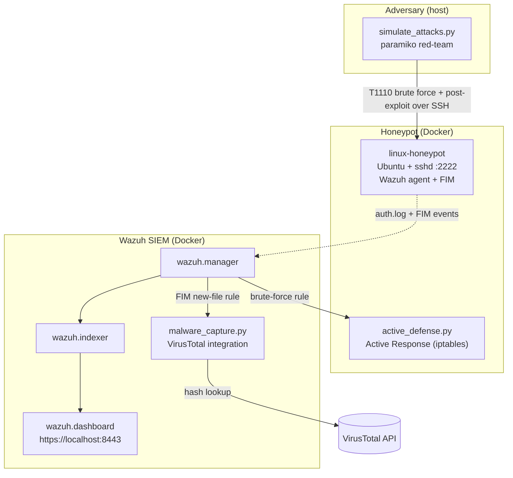

# Threat Intelligence Lab & Active Defense SIEM

<div align="center">
  
  
  
  
  
  
</div>
<br>

> **Detect, respond to, and hunt SSH attacks end-to-end — a Dockerised Wazuh SIEM with a live honeypot and Python SOAR automation.**

A self-contained cybersecurity lab that stands up a **Wazuh SIEM**, an **SSH
honeypot that reports to it as a real agent**, and a **Python red-team script**
that walks a full Cyber Kill Chain against the honeypot. Real attack traffic
produces real detections, which trigger two Python **SOAR** automations:
an Active-Response IP ban and a VirusTotal malware lookup.

Everything runs in Docker on a single host. No cloud account, no separate VMs.

📚 **[API reference & developer portal →](https://jessn-dev.github.io/CTI-Lab/)** — the full Stripe-style docs site (auth, endpoints, cURL/Python/JS snippets, error maps), deployed via **GitHub Pages** from `/docs`.

## Demo


*One `./attack.sh` run, from the real lab: brute-force → foothold → EICAR drop, and Wazuh's automatic response — brute-force detection (rule 5763), an iptables ban, and a VirusTotal verdict.*

The custom **CTI · Threat Overview** dashboard after a few runs — top attacker IP, alert levels, MITRE ATT&CK techniques, top rules, and alerts over time:


---

## Table of Contents
0. [Demo](#demo) · [API reference portal ↗](https://jessn-dev.github.io/CTI-Lab/)
1. [What it does](#what)
2. [Architecture](#architecture)
3. [The attack → detect → respond flow](#flow)
4. [MITRE ATT&CK coverage](#mitre)
5. [Install & run](#install)
6. [Verifying it worked](#verify)
6b. [AI Threat Analyst (Phase A)](#analyst)
6c. [Attack it yourself (manual)](#attack)
7. [Project layout](#layout)
7b. [Scripts reference](#scripts)
8. [Scope, honesty & limitations](#limits)
9. [Troubleshooting](#troubleshooting)

---

<a name="what"></a>
## 1. What it does

- **Bait.** An Ubuntu container runs a real `sshd` with a deliberately weak
  `root:toor` login exposed on port `2222`.
- **Monitor.** The honeypot has a **Wazuh agent baked in**. It enrolls with the
  Wazuh manager on boot and ships `auth.log` and File Integrity Monitoring (FIM)
  events. This is the piece that makes the SIEM story *true*: the manager
  actually receives telemetry.
- **Attack.** `scripts/simulate_attacks.py` uses **paramiko** to perform a real
  SSH brute-force, then opens a session and runs post-exploitation (recon,
  credential dumping, a backdoor account, an EICAR malware drop, log wiping).
- **Detect.** Wazuh's built-in rules flag the brute-force and the dropped file.
- **Respond (SOAR):**
  - `scripts/active_defense.py` runs on the honeypot as a **Wazuh Active
    Response** and `iptables`-bans the attacker's IP (auto-unban on timeout).
  - `scripts/malware_capture.py` runs on the manager as a **Wazuh integration**,
    pulls the FIM SHA-256 out of the alert, and queries the **VirusTotal API**.

<a name="architecture"></a>
## 2. Architecture

Single Docker Compose stack, one network. Based on the official Wazuh 4.8
single-node deployment (TLS-secured indexer/manager/dashboard) plus a custom
honeypot service.



**Diamond Model:** *Adversary* = the paramiko script · *Capability* = SSH
credential attack + EICAR payload · *Infrastructure* = Docker network, port 2222
· *Victim* = the honeypot container.

<a name="flow"></a>
## 3. The attack → detect → respond flow

| # | Red-team action (real) | Blue-team reaction (real) |
|---|------------------------|---------------------------|
| 1 | Port probe of `:2222` | — |
| 2 | SSH password brute-force (paramiko) | Wazuh rules **5710 / 5712** fire → **Active Response bans the source IP** |
| 3 | `whoami`, `uname -a`, `cat /etc/passwd`, `cat /etc/shadow` over SSH | Command/auth telemetry in the SIEM |
| 4 | Create backdoor user `sysadmin_bckp` | FIM change on `/etc`, new-account event |
| 5 | `curl` the **EICAR** test file to `/tmp` | FIM **new-file** alert → **VirusTotal integration** reports the verdict |
| 6 | Wipe `/var/log/auth.log` | No effect — Wazuh already forwarded the events in real time |

<a name="mitre"></a>
## 4. MITRE ATT&CK coverage

| Phase | Technique | ID |
|-------|-----------|----|
| Reconnaissance | Active Scanning | T1595 |
| Initial Access | Brute Force | T1110 |
| Discovery | System Information Discovery | T1082 |
| Credential Access | OS Credential Dumping (`/etc/shadow`) | T1003 |
| Persistence | Create Account | T1136 |
| Command & Control | Ingress Tool Transfer (EICAR) | T1105 |
| Defense Evasion | Indicator Removal (log wipe) | T1070 |
| **Response** | Network Traffic Filtering (D3FEND) | D3-NTF |

<a name="install"></a>
## 5. Install & run

### Prerequisites
- **Docker Desktop** running, with at least **~6 GB RAM** allocated to Docker
  (the OpenSearch indexer alone reserves ~1 GB heap).
- **Python 3.9+** on the host (for the red-team script's virtualenv).

### Quick start

The flow is deliberately **two steps** so you can watch the attack land in the
SIEM live, instead of it happening before you've even logged in.

```bash
git clone <this-repo> && cd threat-intelligence-lab
cp .env.example .env          # optional: VirusTotal + Gemini API keys
chmod +x *.sh

# 1. Bring the lab up (SIEM + honeypot) and wait for the agent to connect.
./start_lab.sh

# 2. Open https://localhost:8443 (admin / SecretPassword), go to
#    Threat Hunting → Security Alerts, then in another terminal:
./attack.sh                   # launch the adversary simulation — watch it appear

# 3. (optional) Generate an AI MITRE ATT&CK report from the detections.
./report.sh
```

`start_lab.sh` generates the Wazuh TLS certs (first run), raises
`vm.max_map_count`, builds the honeypot, brings the stack up, prepares the Python
venv, and **waits for the honeypot agent to connect** — then stops and tells you
to open the dashboard and run `./attack.sh`. It does **not** auto-attack, so you
see the kill chain unfold in real time.

Tear down with `./stop_lab.sh` (add `--wipe` to also delete the data volumes).

### Access points
| Service | URL / command | Port | Credentials |
|---------|---------------|------|-------------|
| Wazuh dashboard | `https://localhost:8443` (accept the self-signed cert) | 8443 | `admin` / `SecretPassword` |
| Wazuh indexer (OpenSearch API) | `curl -k -u admin:SecretPassword https://localhost:9200` | 9200 | `admin` / `SecretPassword` |
| Wazuh manager API | `curl -k -u wazuh-wui:'MyS3cr37P450r.*-' https://localhost:55000` | 55000 | `wazuh-wui` / `MyS3cr37P450r.*-` |
| SSH honeypot | `ssh root@localhost -p 2222` | 2222 | password `toor` |
| API docs portal | [jessn-dev.github.io/CTI-Lab](https://jessn-dev.github.io/CTI-Lab/) | — | — |
| Threat reports (Phase A) | `reports/threat_report_<timestamp>.md` | — | — |

**Internal ports** (agent traffic, not for humans): `1514/tcp` agent→manager,
`1515/tcp` agent enrollment, `514/udp` syslog. Exposed on the host for
convenience/debugging; you don't connect to these directly.

> The first dashboard load can take a couple of minutes while the indexer
> initialises its security index. All Wazuh endpoints use self-signed TLS —
> pass `-k` to curl and accept the browser warning.

<a name="verify"></a>
## 6. Verifying it worked

In the Wazuh dashboard (**Threat Hunting / Security Alerts**), after the sim you
should see:
- **SSH brute force** alerts (rule IDs 5710/5712) with a `srcip`.
- An **Active Response** entry (`active-responses.log`) showing the ban.
- A **File Integrity Monitoring** *added* event for `/tmp/eicar.com.txt`, plus a
  VirusTotal result in the manager's `integrations.log` (open a shell with
  `docker exec -it wazuh.manager tail /var/ossec/logs/integrations.log`).

Confirm the honeypot agent is connected:
```bash
docker exec -it wazuh.manager /var/ossec/bin/agent_control -l
```

### Custom dashboard (shipped as code)

The lab includes a custom **"CTI · Threat Overview"** dashboard: top
attacker IPs, alert-level distribution, MITRE ATT&CK techniques, alerts over
time, top rules, and a total-alert metric. Its saved objects live in
`config/wazuh_dashboard/cti-dashboard.ndjson` and import automatically on
startup (or run `./import-dashboard.sh`).

It's also set as the **default landing page** — after you log in you go straight
to it (via `uiSettings.overrides.defaultRoute` in
`config/wazuh_dashboard/opensearch_dashboards.yml`). To reach the stock Wazuh
overview instead, use the ☰ menu → Wazuh; to revert, set `defaultRoute` back to
`/app/wz-home`. Build your own panels in the UI and re-export the NDJSON to
version them.

### Prefer the terminal? Use `logs.sh`

The dashboard is optional. Everything lives in log files and the indexer, and
`logs.sh` tails them so you don't have to remember the paths:

```bash
./logs.sh          # live alert stream (human-readable)
./logs.sh json     # live alerts: level | rule | srcip | description  (!! = level ≥ 10)
./logs.sh ar       # Active-Response bans
./logs.sh vt       # VirusTotal integration
./logs.sh auth     # honeypot raw SSH auth.log
./logs.sh agents   # enrolled agents + status
```

<a name="analyst"></a>
## 6b. AI Threat Analyst (Phase A)

`scripts/threat_report.py` reads the Wazuh detections the lab produced and asks
an LLM to write a **MITRE ATT&CK incident report**: executive summary,
kill-chain timeline, technique table, IOCs, severity, and recommended actions.
It runs **offline on the logs**, never in the attack path,
so there is no added latency or prompt-injection exposure.

```bash
cp .env.example .env          # add GEMINI_API_KEY (free: https://aistudio.google.com)
source venv/bin/activate
python3 scripts/threat_report.py        # pulls alerts from wazuh.manager
# or analyse a saved file:
python3 scripts/threat_report.py --input path/to/alerts.json
```

Output lands in `reports/threat_report_<timestamp>.md`.

**Guardrails:**
- **Egress / PII.** Attacker IPs, usernames, and file hashes are **pseudonymised
  before leaving the host** (`IP_1`, `USER_1`, `HASH_1`); the provider only ever
  sees tokens, and real values are substituted back into the local report. Toggle
  with `REDACT_PII` (default `true`).
- **Rate limit.** A sliding-window cap (`GEMINI_MAX_RPM`, default 10) enforced
  *across runs* keeps you under the free-tier quota, plus 429/5xx retry with
  exponential backoff (`GEMINI_MAX_RETRIES`). You can't accidentally blow the cap.

**Backend:** Gemini only for now (`LLM_PROVIDER=gemini`, model `GEMINI_MODEL`,
default `gemini-2.5-flash` — it has its own free-tier daily quota; `gemini-2.0-flash`
exhausts quickly). Local/Claude backends are **deliberately deferred** — see
[`docs/ROADMAP.md`](docs/ROADMAP.md). A local model (Ollama) would remove the
third-party egress entirely.

<a name="attack"></a>
## 6c. Attack it yourself (manual)

`./attack.sh` automates the kill chain, but the honeypot is a real `sshd` — you
can attack it by hand and watch Wazuh react. Open the dashboard first
(`https://localhost:8443` → **Threat Hunting → Security Alerts**).

### Local, from this machine
```bash
# 1) Foothold, then run the kill chain by hand
ssh root@localhost -p 2222            # password: toor
#   inside the honeypot:
cat /etc/shadow                                   # credential dump (T1003)
useradd -m sysadmin_bckp                          # persistence → FIM alert
curl -s -o /tmp/evil.txt https://secure.eicar.org/eicar.com.txt  # FIM → VirusTotal
echo "" > /var/log/auth.log                       # log wipe (T1070)

# 2) Brute force (trigger rule 5763 + the Active-Response ban)
for i in $(seq 1 10); do ssh -o StrictHostKeyChecking=no root@localhost -p 2222; done
#   type a wrong password each time
```

> ⚠️ From this machine your source IP is the **Docker gateway** (`192.168.65.1`),
> shared by all host→container traffic. Once the ban fires, **new** SSH
> connections are dropped for 600s (auto-unban), but an **already-open** session
> survives. So log in with `toor` first, then brute-force in a second terminal.

### From another machine — a "clean" external attacker IP
To make Wazuh see a real, distinct attacker IP (and ban only that host), attack
from a **different device on your LAN**:
```bash
# find your Mac's LAN IP
ipconfig getifaddr en0            # e.g. 192.168.1.42

# from the other machine, target that IP:2222
ssh root@192.168.1.42 -p 2222                     # foothold (password: toor)
for i in $(seq 1 10); do ssh -o StrictHostKeyChecking=no root@192.168.1.42 -p 2222; done
```
Now the brute-force `srcip` is the other machine's real address, Active Response
bans **only** that IP, and your Mac keeps working. (Ensure macOS firewall allows
inbound `2222`, and both devices are on the same network.)

<a name="layout"></a>
## 7. Project layout

```
docker-compose.yml            # SIEM (indexer/manager/dashboard) + honeypot
generate-certs.yml            # one-shot Wazuh TLS cert generator
start_lab.sh                  # bring the lab up, wait for the agent (no auto-attack)
attack.sh                     # run the adversary simulation on demand
report.sh                     # generate the AI threat report
logs.sh                       # view the SIEM from a terminal (no dashboard)
import-dashboard.sh           # load the custom "CTI · Threat Overview" dashboard
stop_lab.sh                   # tear down (--wipe clears volumes)
requirements.txt / .env.example
honeypot/
  Dockerfile                  # Ubuntu + sshd + rsyslog + Wazuh agent
  entrypoint.sh               # enroll agent, start rsyslog + sshd
  agent-fim.conf              # realtime FIM on /tmp, /home, /root
config/
  wazuh_dashboard/cti-dashboard.ndjson  # custom dashboard (saved objects, as code)
  wazuh_cluster/wazuh_manager.conf   # + custom Active Response & VT integration
  wazuh_indexer/  wazuh_dashboard/   # official single-node config
  certs.yml                          # cert generator inventory
scripts/
  simulate_attacks.py         # paramiko red-team (Cyber Kill Chain)
  active_defense.py           # Wazuh Active Response: iptables ban
  malware_capture.py          # Wazuh integration: VirusTotal hash lookup
  threat_report.py            # Phase A: AI analyst -> MITRE ATT&CK report
reports/                      # generated threat reports (gitignored)
docs/                         # static portfolio site
```

<a name="scripts"></a>
## 7b. Scripts reference

Every script has a full docstring/header explaining its internals; this is the
quick map of what each one does and when to run it.

### Lifecycle (repo root)
| Script | What it does | When |
|--------|--------------|------|
| `start_lab.sh` | Generates TLS certs (first run), tunes `vm.max_map_count`, builds the honeypot, brings the stack up, prepares the Python venv, waits for the agent to connect, and best-effort auto-imports the custom dashboard. **Does not attack.** | Once, to boot the lab |
| `attack.sh` | Runs the paramiko adversary simulation against the honeypot. | On demand, while watching the dashboard |
| `report.sh` | Runs the offline AI analyst → writes a MITRE ATT&CK report to `reports/`. | After an attack |
| `logs.sh` | Terminal SIEM viewer — `alerts` / `json` / `ar` / `vt` / `auth` / `agents` modes. | Anytime, instead of the dashboard |
| `import-dashboard.sh` | Imports the custom **CTI · Threat Overview** saved objects into the dashboard. | Auto-run by `start_lab.sh`; re-run if needed |
| `stop_lab.sh` | Tears the stack down (`--wipe` also deletes data volumes). | To stop / reset |

### Detection & SOAR logic (`scripts/`)
| Script | Role | How it works |
|--------|------|--------------|
| `simulate_attacks.py` | Red team | `paramiko` over SSH: cracks the weak login and **holds** the session, keeps brute-forcing to trip detection, then runs recon / persistence / EICAR drop / log-wipe — a real 6-phase Cyber Kill Chain. |
| `active_defense.py` | Active Response | Runs on the honeypot agent when Wazuh fires the brute-force rule. Reads the alert JSON from **stdin (`readline`)**, extracts `srcip`, and **appends** an `iptables` DROP (absolute paths — `execd` has a minimal `PATH`). |
| `malware_capture.py` | VirusTotal integration | Runs on the manager on a FIM new-file alert. Pulls the **SHA-256 straight from the alert** and queries VirusTotal via stdlib `urllib` (no deps on the manager image). |
| `threat_report.py` | AI analyst (Phase A) | Offline: reads Wazuh detections, **pseudonymises IOCs before egress**, applies a sliding-window **rate-limit guardrail**, and asks Gemini for a MITRE ATT&CK report. Never in the attack path. |

### Honeypot image (`honeypot/`)
| File | What it does |
|------|--------------|
| `entrypoint.sh` | Installs an `ESTABLISHED,RELATED` accept rule, starts `rsyslog`, pre-creates `/var/log/auth.log`, enrolls the Wazuh agent, then runs `sshd` (no `-e`, so auth logs reach syslog). |
| `Dockerfile` | Ubuntu + `sshd` (weak `root:toor`, raised `MaxStartups`) + `rsyslog` + baked-in Wazuh agent + the AR script. |
| `agent-fim.conf` | Appended to the agent config: realtime FIM on `/tmp`,`/home`,`/root`, the `auth.log` source, and the custom AR `<command>`. |

<a name="limits"></a>
## 8. Scope, honesty & limitations

This is a **portfolio lab**, and it's built to be honest about what is and isn't
real:

- **What's genuinely real:** the SIEM pipeline (agent → manager → indexer →
  dashboard, TLS-secured), the brute-force and FIM *detections*, the
  Active-Response IP ban, and the VirusTotal lookup by hash.
- **The "attacker" IP is the Docker gateway.** Because the red-team script runs
  on the same host, Wazuh sees the container/host gateway as `srcip`. The ban is
  real but self-inflicted, so Active Response uses a **600s timeout auto-unban**
  and the honeypot keeps its outbound path to the manager. To get a "clean"
  external attacker IP, attack from a different LAN machine — see
  [§6c Attack it yourself](#attack).
- **Windows/RDP honeypot was removed.** The original `dockur/windows` image
  needs KVM, which isn't available under Docker Desktop on macOS. On a Linux/KVM
  host you can re-add it as a second honeypot service and enroll a Windows agent.
- **EICAR, not live malware.** The dropped payload is the harmless EICAR test
  string — enough to exercise FIM + VirusTotal without handling real malware.
- **Vulnerability Detection is disabled on purpose.** The Wazuh 4.8 engine
  downloads a large CVE feed from Wazuh's CTI service and correlates it against
  agent package inventories. It's the heaviest module, and under amd64 emulation
  on Apple Silicon the feed download truncates and fails to parse
  (`Error updating feed: parse error …`), leaving the *"Vulnerabilities by year
  of publication"* panels empty. It's also outside this lab's scope (honeypot →
  SIEM detection → SOAR response), so it's turned off in
  `config/wazuh_cluster/wazuh_manager.conf` (`<enabled>no</enabled>`).

  **This is an emulation limitation, not a design flaw.** On a **dedicated
  homelab — native x86_64 Linux** (a mini-PC, an Intel/AMD server, or a Proxmox
  VM), there's no Rosetta/QEMU layer, the Wazuh images run natively, and the CVE
  feed downloads and parses cleanly. Flip `<enabled>yes</enabled>`, give it a few
  minutes to sync, and the *"Vulnerabilities by year of publication"* panels
  populate from the honeypot's package inventory. The lab is fully portable
  there — same `./start_lab.sh`, and you can also re-add the Windows/RDP honeypot
  since KVM is available.
- **Credentials are lab defaults** (`admin/SecretPassword`, `root/toor`,
  `wazuh-wui/...`). Never expose this stack to an untrusted network.

<a name="troubleshooting"></a>
## 9. Troubleshooting

| Symptom | Fix |
|---------|-----|
| Indexer container exits / `max virtual memory areas` error | `vm.max_map_count` too low — rerun `start_lab.sh`, or on Docker Desktop bump it in the LinuxKit VM. |
| Dashboard shows "Indexer not ready" | Give it 1–2 min on first boot; it builds the security index. |
| No agent in `agent_control -l` | Manager wasn't up when the honeypot tried to enroll; `docker compose restart linux-honeypot`. |
| VirusTotal says "no VT_API_KEY set" | Add your key to `.env` and restart the manager (`docker compose up -d wazuh.manager`). |
| Port 8443/2222 already in use | Another service holds the port — change the host side of the mapping in `docker-compose.yml` (e.g. `9443:5601`). |
| `platform (linux/amd64) does not match ... arm64` | Expected on Apple Silicon — Wazuh publishes amd64 only. `platform: linux/amd64` is pinned, so it runs under emulation. Enable Rosetta in Docker Desktop (Settings → General) and give Docker ≥ 8 GB for the indexer. |
| Indexer container keeps restarting on Apple Silicon | OpenSearch under emulation is memory-hungry — raise Docker Desktop's RAM, and confirm `vm.max_map_count` was set (`start_lab.sh` does this). |
| "Vulnerabilities by year of publication" panel is empty | **By design** — Vulnerability Detection is disabled (the CVE feed is huge and fails to sync under emulation, and it's out of scope). See §8. Re-enable in `wazuh_manager.conf` if you want it. |

### Active Response — gotchas worth knowing

Getting a custom Active Response working end-to-end surfaced five non-obvious
requirements. All are handled in the repo; documented here for anyone extending it.

| Symptom | Cause & fix |
|---------|-------------|
| Brute force never detected (no rule 5710/5712/5763) | `sshd -D -e` logs to **stderr, not syslog**, so `rsyslog` never writes `/var/log/auth.log`. Run `sshd -D` (no `-e`) — see `honeypot/entrypoint.sh`. |
| Auth events still not ingested after fixing sshd | The agent had **no log source for auth**, and `auth.log` doesn't exist at boot (created lazily), so logcollector's open fails and never re-attaches. Fix: add a `<localfile>` for `/var/log/auth.log` (`honeypot/agent-fim.conf`) **and** `touch` it in the entrypoint before the agent starts. |
| Rule fires but AR script never runs (execd logs "Executing command", nothing happens) | `wazuh-execd` runs AR scripts with a **minimal PATH**, so `#!/usr/bin/env python3` (needs `env` on PATH) fails, as do bare `iptables` calls. Use an **absolute shebang** (`#!/usr/bin/python3`) and an absolute `/usr/sbin/iptables` — see `scripts/active_defense.py`. |
| AR script starts but hangs / does nothing | `sys.stdin.read()` blocks: execd sends **one JSON line but keeps the stdin pipe open**, so `read()` waits for EOF forever. Use `sys.stdin.readline()`. (A manual `printf … \| script` test passes because the pipe closes — masking the bug.) |
| Manager doesn't dispatch the AR at all | The custom `<command>` must be defined on **both** manager and agent, the executable must resolve on **both** (`docker-compose.yml` mounts it into the manager; the honeypot image bakes it in), and rebuilding the honeypot needs authd `<force>` in `wazuh_manager.conf` or the agent gets stuck on `Duplicate agent name` and never forwards. |
| Active Response ban kills the attacker's live session | Expected if the ban is inserted (`-I`) above the ESTABLISHED accept rule. The lab **appends** the ban (`-A`) after an `ESTABLISHED,RELATED` accept installed at boot, so live sessions survive and only new connections are dropped. |
